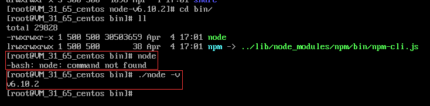

### 腾讯送了个Centos服务器，暂且先捣鼓玩玩吧。
+ 访问nodejs的官方网站的downdolad：https://nodejs.org/en/download/ 下面有个All download options，然后复制下载链接。
+ 转到linux虚拟机，在控制台输入,开始下载：  
```
# wget https://nodejs.org/dist/v6.10.2/node-v6.10.2-linux-x64.tar.gz
```
+ 解压文件，并修改文件名,看着舒服些~
```
# tar xvf node-v6.10.2-linux-x64.tar.gz
# mv node-v6.10.2-linux-x64 node-v6.10.2
```
+ 打开文件夹 运行测试一下 
```
# node -v
```

  
居然not found，好吧还没配置全局环境，需要加相对路径

+ 创建软连接，配置全局环境、可以在任何地方调用node
```
# ln -s /usr/解压路径/bin/node /usr/local/bin/node
# ln -s /usr/解压路径/bin/npm /usr/local/bin/npm
```

node -v 测试一下,完美。
这样就算安装完成了 over~~  
  
  
-----------------------------------

> 顺便说下本片文篇图片引用的问题解决：

1. 把_config.yml中的post_asset_folder改为true
2. 安装插件，如下↓
3. 正常使用Markdown：\!\[\](目录/test.png) 
```
# npm install hexo-asset-image --save
```